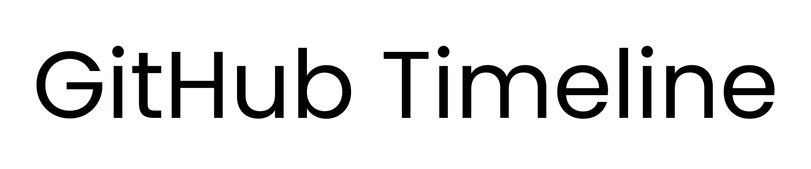
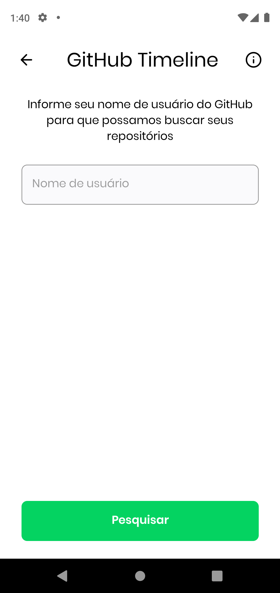
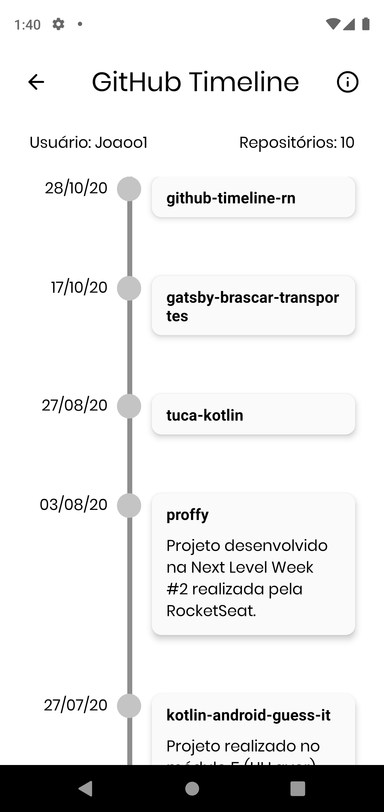

   

<h2 align="center">	
   
   
  
</h1>

<h3 align="center">Ferramenta para gerar a sua linha do tempo no github </h3>

  

 Usando o poder de uma stack poderosa, que utiliza de uma única linguagem popular e moderna, o JavaScript.   Produtividade e performance de forma enxuta. 

 

## Projeto
Este é um projeto dedicado para qualquer pessoa que possuí repositórios hospedados no GitHub e querem ter uma visualização da trajetória durante todo o tempo em que já utilizou o GitHub. O objeto deste projeto foi principalmente didático e de crescimento profissional para mim, onde coloquei em prática alguns dos meus conhecimentos adquiridos através de estudos. 

## Tecnologias usadas
Algumas das tecnologias utilizadas neste projeto:

* **[React Native](https://reactnative.dev)**

* **[Expo](https://expo.io/)**

* **[ESLint](https://eslint.org/)**

* **[Axios](https://github.com/axios/axios)**

## Demo
### Aplicativo mobile

   
   
   

## Contribua
Se você deseja contribuir de alguma forma para o crescimento deste projeto, sinta a vontade para contribuir, qualquer ajuda será bem-vinda! 

